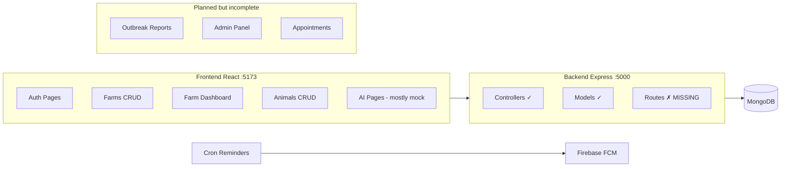

# LifeStock Animal Platform — Code Review

**Project:** ITI Graduation Project — LifeStock Animal Health Platform  
**Review date:** June 29, 2026  
**Stack:** Node.js + Express + MongoDB (backend) · React 19 + Vite + Redux + Tailwind (frontend)

---

## Executive Summary

**LifeStock** (رعاية الماشية) is a livestock health management platform aimed at Egyptian farmers. It covers farms, animals, vaccinations, AI-powered diagnosis, and notifications — with a full Arabic RTL UI.

The backend has solid **controllers and models**, but the **`backend/routes/` folder is missing entirely** (the server cannot start as-is). There is **no role-based access control (RBAC)** — every authenticated user is treated as a farm owner. An admin dashboard and a **user / doctor / admin** role model need to be built on top of the existing foundation.

---

## Architecture Overview

**Secondary service:** `backend/rag.js` — standalone RAG/AI server on port 3000 (PDF ingestion, vector search, multimodal analyze).

---

## Strengths

| Area | Details |
|------|---------|
| **Authentication** | Email verification, Google OAuth, JWT access token + httpOnly refresh cookie, OTP password reset |
| **Data model** | Clear Mongoose schemas with cascade deletes (farm → animals → health cases + vaccinations) |
| **Security basics** | bcrypt (cost 12), hashed verification tokens/OTPs, `protect` middleware, inactive account blocking |
| **Domain logic** | Vaccination recurring dates, cron reminders (Cairo timezone), farm stats aggregation |
| **Frontend structure** | Redux Toolkit, centralized `api.js` with auto token refresh, farm-scoped dashboard layout |
| **UI/UX** | Consistent Arabic RTL, Cairo font, green agricultural theme (#2d5a1b, #3d6b47) |

---

## Critical Issues (Must Fix Before Production)

### 1. Missing route files

`server.js` imports 8 route modules that **do not exist** in the repository:

| Expected file | Mount path |
|---------------|------------|
| `routes/Auth.routes.js` | `/api/auth` |
| `routes/User.routes.js` | `/api/users` |
| `routes/Farm.routes.js` | `/api/farms` |
| `routes/Animal.routes.js` | `/api/animals` |
| `routes/Vaccination.routes.js` | `/api/vaccinations` |
| `routes/Healthcase.routes.js` | `/api/health-cases` |
| `routes/onboarding.routes.js` | `/api/onboarding` |
| `routes/notification.routes.js` | `/api/notifications` |

**Impact:** Server crashes on startup with `Cannot find module './routes/...'`.

### 2. Missing service files

Referenced by controllers/cron but absent:

- `backend/services/aiagent.js` — used by `Healthcase.controller.js`
- `backend/services/Onboardingagent.js` — used by `Onboarding.controller.js`
- `backend/services/notificationService.js` — used by `Cron_vaccinationreminder.js`

### 3. No role-based access control (RBAC)

The User model (`backend/models/user.js`) has **no `role` field**. All authenticated users share the same permissions. Access control is **resource ownership only** (farms scoped by `user_id`).

There is no admin, doctor, or farmer distinction in backend or frontend.

### 4. Frontend / backend API mismatch

| Frontend expects | Backend status |
|------------------|----------------|
| `GET /api/animals/:id/diagnoses` | Not implemented |
| `GET /api/animals/:id/weights` | Not implemented |
| `GET /api/farms/:id/vaccinations` | Not in Farm controller |
| `GET /api/farms/:id/alerts` | Not in Farm controller |
| `GET/POST /api/outbreaks/*` | Model only; no API |
| Notifications CRUD | Model exists; controller missing |

### 5. Mock vs real data on frontend

| Feature | Integration status |
|---------|-------------------|
| Auth, farms, animals CRUD, notifications | Real API |
| Farm dashboard stats | Real API |
| AI assistant, diagnosis, vaccine agent | Fully mock |
| Vaccinations overview page | Mock data |
| Image analysis | Partial mock |
| Outbreak detection | Built but unrouted; simulated API |

### 6. Auth session fragility (frontend)

- Redux auth state is **not persisted** — page refresh loses session unless refresh cookie succeeds
- `fetchProfile` thunk exists but is **never dispatched** on app load
- Sidebar logout uses sync `logout()` reducer, not `logoutUser` async thunk — server logout may be skipped
- Google login in `Login.jsx` uses hardcoded `http://localhost:5000` instead of env variable

### 7. Routing bugs (frontend)

- `/animals/add` is not nested under `/farms/:farmId` but `AddAnimalPage` may need `farmId` from URL params
- `OutbreakDetectionPage.jsx` exists but has **no route** in `AppRoutes.jsx`
- Duplicate diagnosis pages: `src/pages/DiagnosisPage.jsx` (routed) vs `src/pages/Diagnosis/DiagnosisPage.jsx` (unused)
- Wildcard `*` redirects to `/farms`, not `/`

### 8. Dead / legacy code (frontend)

| File | Issue |
|------|-------|
| `src/services/axiosInstance.js` | Separate base URL, reads `localStorage.token` — unused |
| `src/services/authApi.js` | Placeholder — superseded by `authService.js` |
| `src/services/dashboardService.js` | Raw fetch to different URL — unused |
| `src/services/aiApi.js` | Not imported anywhere |

### 9. Minor inconsistencies

- Folder typo: `backend/middelwares` (should be `middlewares`)
- Hardcoded vet title "طبيبة بيطرية أولى" in mock data regardless of actual user
- `testReminder.js` references outdated export name from cron module

---

## Backend — Module Inventory

### API endpoints (inferred from controllers)

#### Auth — `/api/auth`

| Method | Path | Purpose |
|--------|------|---------|
| POST | `/register` | Create account; send email verification |
| GET | `/verify-email?token=` | Verify email; return access token |
| POST | `/resend-verification` | Resend verification (rate-limited ~2 min) |
| POST | `/login` | Email/password login (requires verified email) |
| POST | `/google` | Google OAuth via `id_token` |
| POST | `/refresh` | Issue new access token from refresh cookie |
| POST | `/logout` | Clear refresh cookie |
| POST | `/forgot-password` | Send 6-digit OTP email |
| POST | `/reset-password` | Reset password with email + OTP |

#### Users — `/api/users` (protected)

| Method | Path | Purpose |
|--------|------|---------|
| GET | `/me` | Current user profile |
| PUT | `/me` | Update profile fields |
| PUT | `/me/password` | Change password (local users only) |
| PUT | `/me/fcm-token` | Save Firebase push token |
| DELETE | `/me` | Soft-delete account |

#### Farms — `/api/farms` (protected)

| Method | Path | Purpose |
|--------|------|---------|
| POST | `/` | Create farm |
| GET | `/` | List user's farms |
| GET | `/:id` | Single farm (ownership check) |
| PUT | `/:id` | Update farm |
| DELETE | `/:id` | Delete farm + cascade animals |
| GET | `/:id/stats` | Aggregated stats |

#### Animals — `/api/animals` (protected)

| Method | Path | Purpose |
|--------|------|---------|
| POST | `/` | Add animal (optional image upload) |
| GET | `/farm/:farmId` | List animals with filters |
| GET | `/:id` | Single animal |
| PUT | `/:id` | Update animal |
| DELETE | `/:id` | Delete animal + cascade records |

#### Vaccinations — `/api/vaccinations` (protected)

| Method | Path | Purpose |
|--------|------|---------|
| POST | `/` | Create vaccination record |
| GET | `/animal/:animalId` | List by animal |
| GET | `/:id` | Single record |
| PUT | `/:id` | Update record |
| DELETE | `/:id` | Delete record |

#### Health cases — `/api/health-cases` (protected)

| Method | Path | Purpose |
|--------|------|---------|
| POST | `/diagnose` | Text AI diagnosis |
| POST | `/diagnose/voice` | Voice → Whisper → diagnosis |
| POST | `/diagnose/image` | Image + Gemini vision diagnosis |
| GET | `/animal/:animalId` | Case history for animal |
| GET | `/consultations` | General consultations |
| GET | `/:id` | Single case |
| PUT | `/:id/resolve` | Mark resolved |

#### Onboarding — `/api/onboarding` (protected)

| Method | Path | Purpose |
|--------|------|---------|
| POST | `/:animalId/chat` | AI chat for medical history |
| POST | `/:animalId/confirm` | Persist extracted data |

#### RAG service — port 3000 (`rag.js`)

| Method | Path | Purpose |
|--------|------|---------|
| POST | `/store` | Ingest PDF into vector store |
| POST | `/chat` | Simple LLM chat |
| POST | `/analyze` | Multimodal RAG analysis |
| POST | `/voice` | Audio transcription + RAG |

### Database models

| Model | Collection | Key fields |
|-------|------------|------------|
| `User` | `users` | name, email, password, governorate, Google OAuth, FCM, is_active |
| `Farm` | `farms` | user_id, name, governorate, total_animals |
| `Animal` | `animals` | farm_id, tag_number, species, breed, health_status, weight |
| `Vaccination` | `vaccinations` | animal_id, vaccine_name, type, dates, reminders |
| `HealthCase` | `healthcases` | animal_id, symptoms, AI diagnosis, severity |
| `Consultation` | `consultations` | General AI consultations (no animal link) |
| `Notification` | `notifications` | user_id, type, title, body, is_read |
| `OutbreakReport` | `outbreakreports` | disease_name, governorate, status — **no API yet** |

### Auth middleware

File: `backend/middelwares/Auth.middleware.js`

- `protect` — validates Bearer token, loads user, rejects inactive accounts
- **Missing:** `authorize(...roles)` for RBAC

### Cron jobs

- `Cron_vaccinationreminder.js` — daily 8:00 Cairo; day-before, day-of, overdue vaccination reminders via FCM

---

## Frontend — Module Inventory

### Public routes

| Path | Page |
|------|------|
| `/` | Landing page |
| `/login` | Login (email + Google) |
| `/register` | Register |
| `/verify-email` | Email verification |
| `/forgot-password` | Forgot password |
| `/verify-otp` | OTP verification |
| `/reset-password` | Reset password |

### Protected routes — farmer flow

| Path | Page | API status |
|------|------|------------|
| `/farms` | Farms list | Live |
| `/farms/add` | Add farm | Live |
| `/farms/:farmId` | Dashboard | Live stats |
| `/farms/:farmId/animals` | Animals list | Live |
| `/farms/:farmId/ai-assistant` | AI assistant | Mock |
| `/farms/:farmId/diagnosis` | Diagnosis | Mock |
| `/farms/:farmId/image-analysis` | Image analysis | Partial mock |
| `/farms/:farmId/vaccinations` | Vaccinations | Mock |
| `/farms/:farmId/emergencies` | Coming soon | Placeholder |
| `/farms/:farmId/library` | Coming soon | Placeholder |
| `/farms/:farmId/reports` | Coming soon | Placeholder |
| `/animals/*` | Animal CRUD, vaccinations, medical records | Live |
| `/notifications` | Notifications | Live + demo fallback |
| `/vaccine-agent` | Vaccine agent | Mock |

### UI shells

1. **Landing** — Navbar, Hero, Features, Testimonials, CTA, Footer
2. **Auth** — Split layout (green image panel + form, RTL)
3. **Farm dashboard** — `MainLayout` with fixed Sidebar (right) + Topbar + Outlet
4. **Standalone pages** — Custom headers (farms list, animal CRUD)

### Redux slices

| Slice | File | Domain |
|-------|------|--------|
| `auth` | `redux/authSlice.js` | Login, register, Google, logout |
| `farm` | `redux/farmSlice.js` | Farms, current farm, stats |
| `animal` | `redux/animalSlice.js` | Animal profile, vaccinations, medical history |
| `dashboard` | `redux/dashBoard/dashboardSlice.js` | Dashboard UI state |

### Key service files

| File | Endpoints |
|------|-----------|
| `services/api.js` | Axios instance, auto refresh on 401 |
| `services/authService.js` | `/api/auth/*` |
| `services/userService.js` | `/api/users/me/*` |
| `services/farmService.js` | `/api/farms/*` |
| `features/animals/services/animalService.js` | `/api/animals/*` |

---

## Complete Feature List

### Implemented (backend controllers exist)

- User registration with email verification
- Google OAuth login
- JWT access + refresh token flow
- Password reset via OTP
- User profile management (update, change password, FCM token, soft delete)
- Farm CRUD with ownership scoping
- Farm statistics (animals by species and health status)
- Animal CRUD with image upload and tag numbers
- Vaccination records (one-time and recurring) with auto next-due dates
- Vaccination reminder cron job (FCM push)
- AI health diagnosis (text, voice, image)
- Health case history and resolution
- General AI consultations (no animal linked)
- Onboarding AI agent for new animal medical history
- Notification model (API incomplete)
- RAG knowledge base microservice

### Frontend — live features

- Full auth flow (register → verify → login → reset password)
- Farm management (list, create, dashboard)
- Animal management (CRUD, profile, vaccinations, medical records)
- Farm dashboard with real stats and charts
- Notifications page

### Planned / incomplete

- Admin dashboard and user management
- Doctor/veterinarian portal
- Role-based access (user, doctor, admin)
- Outbreak detection API and routing
- Appointments module (not started)
- Emergencies, library, reports pages
- Wire mock AI pages to real backend
- Missing route files and services

---

## Recommended Role Model (for future work)

| Role | Arabic label | Intended access |
|------|--------------|-----------------|
| `user` | مربي / مزارع | Own farms and animals only (current behavior) |
| `doctor` | طبيب بيطري | Health cases, consultations, outbreak monitoring |
| `admin` | مدير النظام | Full platform access — users, data, analytics, broadcasts |

Suggested backend changes:

- Add `role` field to User model
- Add `authorize(...roles)` middleware
- Admin routes at `/api/admin/*`
- Doctor routes at `/api/doctor/*`
- Never allow self-registration as admin or doctor

---

## Priority Fix Order

1. Recreate missing `backend/routes/*.js` files
2. Implement missing services (`aiagent`, `Onboardingagent`, `notificationService`)
3. Add `role` field and RBAC middleware
4. Build admin and doctor API modules
5. Fix frontend auth persistence and login redirect by role
6. Wire mock pages to real APIs
7. Route `OutbreakDetectionPage` and connect to backend

---

## File Reference Map

| Concern | Primary files |
|---------|---------------|
| Server entry | `backend/server.js` |
| User model | `backend/models/user.js` |
| Auth middleware | `backend/middelwares/Auth.middleware.js` |
| Controllers | `backend/controllers/*.js` |
| Frontend routing | `frontend/src/routes/AppRoutes.jsx` |
| Route guard | `frontend/src/routes/ProtectedRoute.jsx` |
| Auth state | `frontend/src/redux/authSlice.js` |
| HTTP client | `frontend/src/services/api.js` |
| Layout | `frontend/src/layout/MainLayout.jsx`, `Sidebar.jsx`, `Topbar.jsx` |
| Sidebar config | `frontend/src/constant/mockData.js` |
| Outbreak UI (unrouted) | `frontend/src/pages/OutbreakDetection/OutbreakDetectionPage.jsx` |
